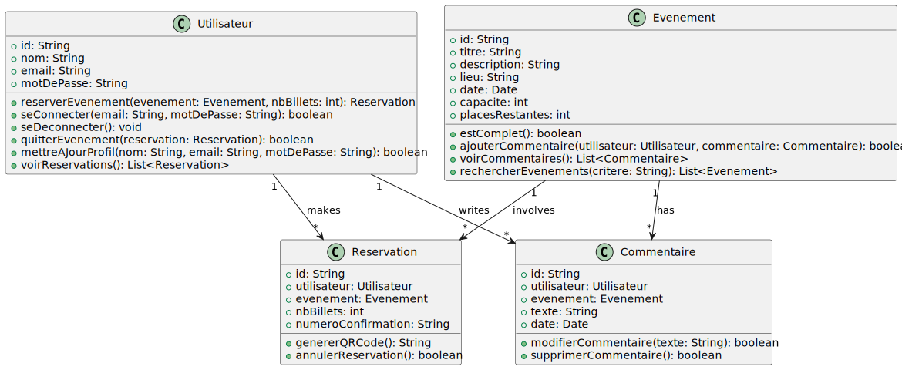
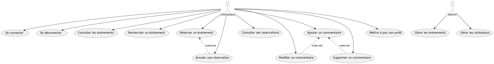

# Yevent

Yevent est une application mobile développée en **React Native** avec **Expo**, conçue pour permettre aux utilisateurs de réserver facilement des événements. Ce projet met en avant une interface utilisateur intuitive et des fonctionnalités robustes de gestion d'événements et de réservations.

## Table des matières
1. [Résumé du Projet](#résumé-du-projet)
2. [Fonctionnalités](#fonctionnalités)
3. [Diagrammes](#diagrammes)
    - [Diagramme de Classes](#diagramme-de-classes)
    - [Diagramme de Cas d'Utilisation](#diagramme-de-cas-dutilisation)
4. [Technologies Utilisées](#technologies-utilisées)
5. [Instructions pour Exécuter le Projet](#instructions-pour-exécuter-le-projet)
6. [Contributeurs](#contributeurs)

---

## Résumé du Projet
Yevent est conçu pour offrir une expérience fluide et rapide aux utilisateurs souhaitant :
- Découvrir des événements disponibles.
- Réserver des billets pour leurs événements préférés.
- Gérer leurs réservations et leurs informations personnelles.

L'application utilise **Supabase** pour la gestion des données et intègre des fonctionnalités natives telles que la géolocalisation et les QR Codes.

---

## Fonctionnalités
### Utilisateur
- Connexion et déconnexion sécurisées.
- Consultation et recherche d'événements.
- Réservation et annulation de billets.
- Ajout, modification et suppression de commentaires.
- Mise à jour du profil utilisateur.

### Administrateur
- Gestion des événements (ajout, modification, suppression).
- Gestion des utilisateurs.

---

## Diagrammes

### Diagramme de Classes
Voici le diagramme de classes représentant les relations principales entre les entités du système :



### Diagramme de Cas d'Utilisation
Voici le diagramme de cas d'utilisation exposant les interactions entre les acteurs et les fonctionnalités principales de l'application :



---

## Technologies Utilisées
- **React Native** avec **Expo** pour le développement front-end.
- **Supabase** pour le backend (gestion des utilisateurs, événements, et réservations).
- **PlantUML** pour la modélisation des diagrammes.
- **Figma** pour le design UI/UX.

---

## Instructions pour Exécuter le Projet
1. Clonez ce repository :
   ```bash
   git clone https://github.com/username/yevent.git
   ```
2. Installez les dépendances :
   ```bash
   npm install
   ```
3. Lancez l'application avec Expo :
   ```bash
   npx expo start
   ```
4. Configurez Supabase avec les tables nécessaires pour utilisateurs, événements et réservations.

---

## Contributeurs
- **Célian Frasca** - Développeur principal et architecte du projet.